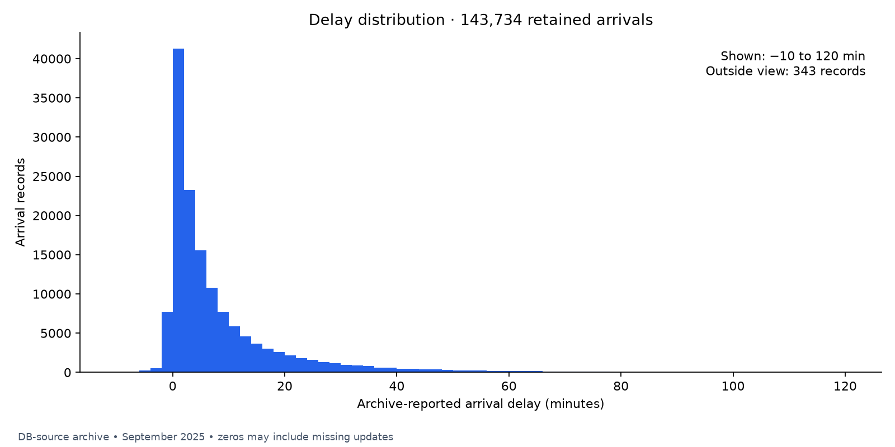
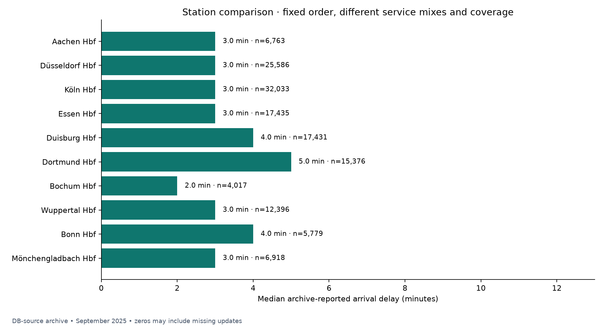
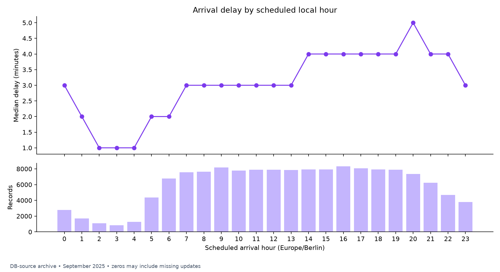
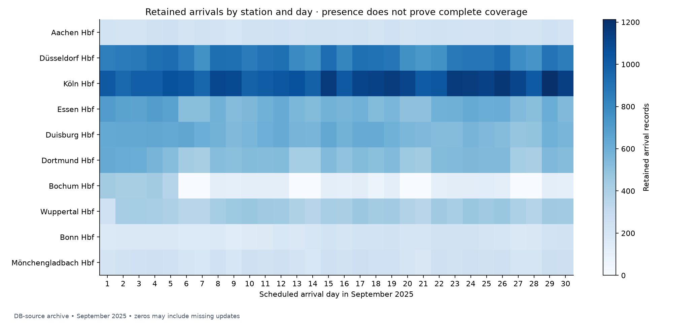

# NRW railway arrivals — September 2025

The cleaned subset contains **143,734 arrival records** from ten selected
stations. Median archive-reported delay is **3.0 minutes**;
the 90th percentile is **22.0 minutes**. These describe this
archive subset, not verified DB punctuality or all NRW services.

## Data and exclusions

Source: Deutsche Bahn data, archived and processed by Piet Brömmel / piebro,
CC BY 4.0. [Pinned download](https://huggingface.co/datasets/piebro/deutsche-bahn-data/resolve/3e9e69149f4008d0c24348c51d1ec79b552adaa5/monthly_processed_data/data-2025-09.parquet).
Source SHA-256: `b0a8ff188b26cd22dca7c477c50f3eb7e9b4a0fd918fc5cd56e37e1cd646ccef`.
The file contains 1,952,591 records; 216,926
belong to the ten selected station identifiers. Remaining source records are
outside the selected station scope. The raw file is preserved.

Exclusions below are sequential and mutually exclusive; their sum plus retained
records equals the selected input. Cancellation counts here follow earlier
exclusions and are not cancellation rates for all services.

| Exclusion | Records |
| --- | ---: |
| missing stop id | 0 |
| duplicate station stop key | 0 |
| bus | 20,332 |
| missing train category | 0 |
| arrival canceled | 9,417 |
| unknown cancellation status | 0 |
| missing or invalid arrival pair | 43,429 |
| planned arrival outside september | 14 |

Retained scheduled dates: 2025-09-01 to 2025-09-30.
Missing-value counts before cleaning, category counts, software versions, and
days represented per station are in [quality.json](quality.json).

## Arrival delays

All statistics retain early arrivals and extreme delays. The histogram shows
−10 to 120 minutes and labels the number outside that range. There are
8,771 negative delays and
0 delays with absolute magnitude above
24 hours, flagged for review. The observed range is -120.0 to
406.0 minutes.

22,686 records (15.8%) have equal planned
and changed arrival times. Missing updates were filled with scheduled times
upstream, so zero is ambiguous. Removing all zeros would introduce another bias.

## Stations

| Station | Retained arrivals | Median minutes | 90th percentile minutes |
| --- | ---: | ---: | ---: |
| Aachen Hbf | 6,763 | 3.0 | 17.0 |
| Düsseldorf Hbf | 25,586 | 3.0 | 20.0 |
| Köln Hbf | 32,033 | 3.0 | 21.0 |
| Essen Hbf | 17,435 | 3.0 | 22.0 |
| Duisburg Hbf | 17,431 | 4.0 | 25.0 |
| Dortmund Hbf | 15,376 | 5.0 | 25.0 |
| Bochum Hbf | 4,017 | 2.0 | 15.0 |
| Wuppertal Hbf | 12,396 | 3.0 | 20.0 |
| Bonn Hbf | 5,779 | 4.0 | 25.0 |
| Mönchengladbach Hbf | 6,918 | 3.0 | 20.0 |

These are descriptive comparisons in fixed station order. Service mix and
coverage differ; the chart is not a station performance ranking. Source train
categories are preserved without inferring operator ownership. Bus records are
excluded; other observed categories remain separate in the cleaned data.

## Time of day and coverage

Hourly differences may reflect different trains and stations serving each hour.
The coverage grid includes all 30 scheduled arrival dates, including zero-count
cells. Daily presence does not prove complete hourly collection. The earlier
source audit found a sharp change in Bochum counts after September 5; investigate
service changes and collection gaps before interpreting this as a delay effect.

Coverage after cleaning: Bochum Hbf: 22/30 days

## Limits and next checkpoint

- Arrival delay is changed minus planned arrival, not the archive's mixed
  departure/arrival `delay_in_min` field. It is a proxy with schedule fallback.
- The archive contains DB-source records and does not identify all operators.
- Missing arrival pairs can include origin-only stops. Cancellations are
  separate outcomes, not zero-delay arrivals.
- Timestamps are interpreted as Europe/Berlin; invalid or ambiguous local times
  are excluded. Source timestamps remain in the cleaned file alongside UTC values.
- Source monthly membership uses changed departure/arrival time. Filtering by
  planned arrival date cannot recover records stored in adjacent monthly files.
- This is one historical month with selected stations and retrospective records.
  It does not establish causality, current performance, or annual patterns.
- No prediction model has been trained. Next validate adjacent months and
  journey keys, then compare schedule-based predictions with a naive baseline.

Reproduce from the project root with `.venv/bin/python -m raildelay`.
Numeric chart data: [station summary](station-summary.csv),
[hourly summary](hourly-summary.csv), [daily coverage](daily-coverage.csv).
